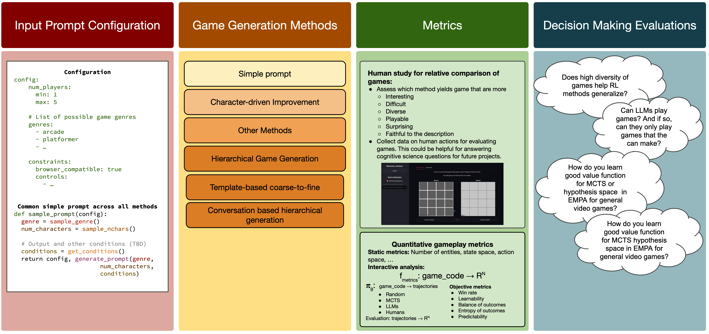

# Generative Games


**Overview:** In this paper, we present methods for generating games using LLMs. We study these methods through the lens of quality and diversity. Primarily, we conduct human-study to gather preferences on games based on metrics such as interestingness, fun, learnability, difficulty, etc. to demonstrate the efficacy of these methods. Furthermore, we have metrics inspired prior work including AI based gameplay testing to evaluate similar notions. Using the generative games, we also evaluate the performance of existing decision making algorithms on out-of-distribution games. This allows us to investigate questions such as "Does higher diversityy in games lead to improved out-of-distribution performance?"

Video games are not just a great source of entertainment; they serve as sophisticated laboratories where we can probe, model, and understand facets of intelligence such as abstraction, reasoning, planning, robustness, and adaptability. A game is fundamentally an interaction between agents and an environment, where agents act to achieve an objective within defined constraints, relying on an engaging narrative embellished with compelling aesthetic assets and materialized with a well-implemented codebase. With rapid advancements in generative models for language, visual content, and code, the automated creation of video games is fast approaching. Current large language models can output games given a single simple prompt mentioning the genre and number of characters as input. Though, the generated games fail to compile or are unplayable due to implementation bugs and unrealistic mechanics, while the functional games reflect a narrow spectrum of design possibilities and are either too simplistic or excessively challenging. 


## Setup
For game generation, we use the `game_generators` folder.

Firstly, you should create a .env file in the root directory and add your API keys. You could use the .env.example file and replace the placeholders with your own API keys, rename the file to .env.

```bash
OPENAI_API_KEY=YOUR_OPENAI_API_KEY
ANTHROPIC_API_KEY=YOUR_ANTHROPIC_API_KEY
```

Then, you could run the following command to install the dependencies.

TODO: Add instructions


### Defining games


### Methods

Input: A game concept generated by a LLM. The game concepts can be 1-5 sentences.
Output: 
- javascript files
- description of the game with key mappings

#### Single simple prompt

#### Character-driven improvement

#### Hierachical method

**Template-based coarse-to-fine game generation:**

**"Conversation"-based hierarchical generation:**


### Analysis

##### Human Study


